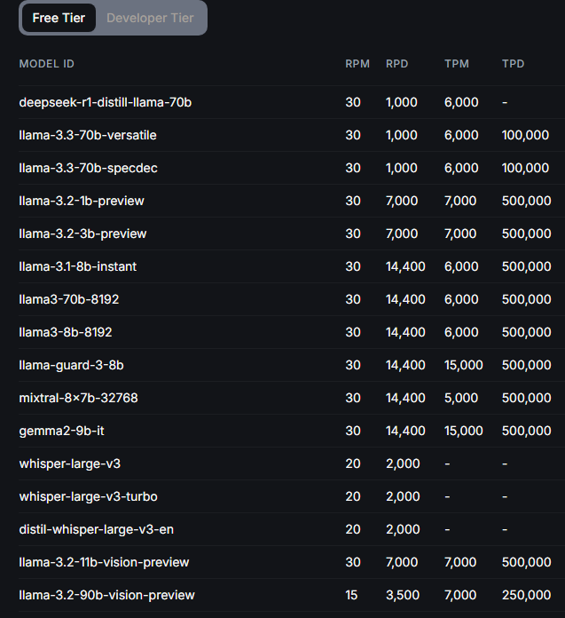

# Result of testing

## Conclusion

Considering tokens limits in groq cloud and the number of tokens we have used for 10 emails, we could be able to receive and report at least **70 emails per day** if we use the models with the most daily limitation (100.000 tokens per day).

### Total AI usage

These are numbers to summarize 10 emails and create a report with all of them:

|   n_emails | model                         |   prompts_tokens |   completions_tokens |   totals_tokens |
|-----------:|:------------------------------|-----------------:|---------------------:|----------------:|
|         10 | deepseek-r1-distill-llama-70b |             7226 |                 6154 |           13380 |

#### Results of summaries

| email_ids   | models                        |   prompts_tokens |   completions_tokens |   totals_tokens |
|:------------|:------------------------------|-----------------:|---------------------:|----------------:|
| email_1     | deepseek-r1-distill-llama-70b |              599 |                  520 |            1119 |
| email_10    | deepseek-r1-distill-llama-70b |              522 |                  386 |             908 |
| email_2     | deepseek-r1-distill-llama-70b |              568 |                  487 |            1055 |
| email_3     | deepseek-r1-distill-llama-70b |              552 |                  395 |             947 |
| email_4     | deepseek-r1-distill-llama-70b |              548 |                  342 |             890 |
| email_5     | deepseek-r1-distill-llama-70b |              536 |                  508 |            1044 |
| email_6     | deepseek-r1-distill-llama-70b |              558 |                  542 |            1100 |
| email_7     | deepseek-r1-distill-llama-70b |              535 |                  369 |             904 |
| email_8     | deepseek-r1-distill-llama-70b |              527 |                  328 |             855 |
| email_9     | deepseek-r1-distill-llama-70b |              539 |                  444 |             983 |

##### Totals

|   n_emails | model                         |   prompts_tokens |   completions_tokens |   totals_tokens |
|-----------:|:------------------------------|-----------------:|---------------------:|----------------:|
|         10 | deepseek-r1-distill-llama-70b |             5484 |                 4321 |            9805 |

#### Results of reports

|   n_emails | models                        |   prompts_tokens |   completions_tokens |   totals_tokens |
|-----------:|:------------------------------|-----------------:|---------------------:|----------------:|
|         10 | deepseek-r1-distill-llama-70b |             1742 |                 1833 |            3575 |

### Rate limits in Groq cloud

* RPM: Requests per minute
* RPD: Requests per day
* TPM: Tokens per minute
* TPD: Tokens per day

