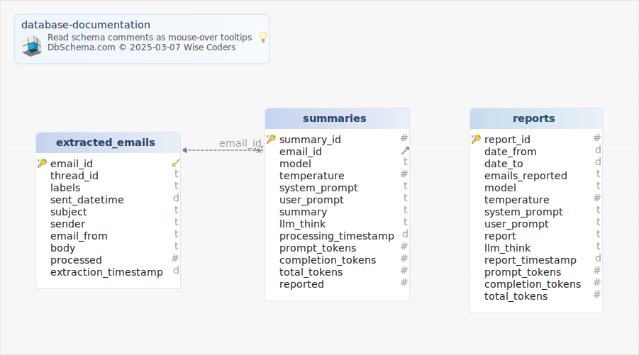

# Database documentation

## Main Diagram

## Tables

1. [Default.extracted_emails](#table%20default.extracted\_emails) 
2. [Default.reports](#table%20default.reports) 
3. [Default.summaries](#tabledefault.summaries) 

### Table Default.extracted_emails

|Idx |Name |Data Type |
|---|---|---|
| * &#128273;  &#11019; | email\_id| TEXT  |
|  | thread\_id| TEXT  |
|  | labels| TEXT  |
|  | sent\_datetime| DATETIME  |
|  | subject| TEXT  |
|  | sender| TEXT  |
|  | email\_from| TEXT  |
|  | body| TEXT  |
|  | processed| NUMERIC  |
|  | extraction\_timestamp| DATETIME  |

### Table Default.reports

|Idx |Name |Data Type |
|---|---|---|
| * &#128273;  | report\_id| INTEGER AUTOINCREMENT |
|  | date\_from| DATETIME  |
|  | date\_to| DATETIME  |
|  | emails\_reported| TEXT  |
|  | model| TEXT  |
|  | temperature| NUMERIC  |
|  | system\_prompt| TEXT  |
|  | user\_prompt| TEXT  |
|  | report| TEXT  |
|  | llm\_think| TEXT  |
|  | report\_timestamp| DATETIME  |
|  | prompt\_tokens| INTEGER  |
|  | completion\_tokens| INTEGER  |
|  | total\_tokens| INTEGER  |

### Table Default.summaries

|Idx |Name |Data Type |
|---|---|---|
| * &#128273;  | summary\_id| INTEGER AUTOINCREMENT |
| &#11016; | email\_id| TEXT  |
|  | model| TEXT  |
|  | temperature| NUMERIC  |
|  | system\_prompt| TEXT  |
|  | user\_prompt| TEXT  |
|  | summary| TEXT  |
|  | llm\_think| TEXT  |
|  | processing\_timestamp| DATETIME  |
|  | prompt\_tokens| INTEGER  |
|  | completion\_tokens| INTEGER  |
|  | total\_tokens| INTEGER  |
|  | reported| NUMERIC  |

#### Foreign Keys

|Type |Name |On |
|---|---|---|
|  | FK_summaries extracted_emails | ( email\_id ) ref [Default.extracted\_emails](#extracted\_emails) (email\_id) |
